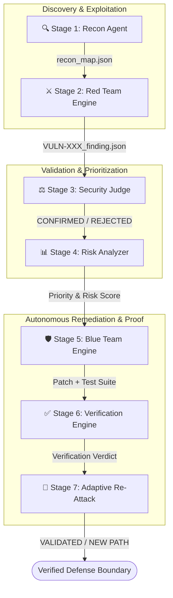

# 🛡️ SecureBank — Autonomous DevSecOps Pipeline

> **Autonomous Red Team vs. Blue Team Security Feedback Loop**  
> *Powered by IBM Bob 2.0 Multi-Agent Orchestration*

[](https://render.com)
[](https://www.python.org/)
[](https://vitejs.dev/)
[](https://flask.palletsprojects.com/)

---

## 📌 Overview

**SecureBank Autonomous DevSecOps** is a end-to-end multi-agent security platform built for the **IBM Bob 2.0 Hackathon**. The system orchestrates an autonomous closed-loop cycle where AI Red Team agents actively exploit application vulnerabilities, a Security Judge validates findings to eliminate false positives, a Risk Analyzer prioritizes issues, AI Blue Team agents generate code patches and regression tests, and a Verification Engine proves remediation.

---

## 🔄 7-Stage Autonomous Security Loop



---

## ✨ Key Components & Multi-Agent Architecture

### 1. 🔍 Recon Agent (`Stage 1`)
- Maps the application attack surface (routes, endpoints, parameters, authentication boundaries).
- Outputs a structured attack surface catalog (`recon_map.json`).

### 2. ⚔️ Red Team Engine (`Stage 2`)
Executes real-world multi-vector HTTP exploits against the target application:
- **VULN-001**: Broken Object Level Authorization (IDOR/BOLA) on user profile routes.
- **VULN-002**: SQL Injection (SQLi) in transaction search endpoint.
- **VULN-003**: Stored Cross-Site Scripting (XSS) in transfer memo field.
- **VULN-004**: Unsafe File Upload permitting execution of arbitrary `.html` scripts.
- **VULN-005**: Privilege Escalation via HTTP header override (`X-Admin-Override`).

### 3. ⚖️ Security Judge (`Stage 3`)
- Independently reproduces each Red Team finding in a clean environment.
- Eliminates false positives before triggering costly remediation cycles.

### 4. 📊 Risk Analyzer (`Stage 4`)
- Computes CVSS-like risk scores (0.0 – 10.0) based on exploitability, blast radius, and business impact.
- Categorizes urgency into *Emergency (Immediate)*, *High (24-48h)*, or *Standard Sprint*.

### 5. 🛡️ Blue Team Engine (`Stage 5`)
- Performs root-cause analysis on source code.
- Generates precise code patches and writes automated regression tests (`test_regression_vuln-XXX.py`).

### 6. ✅ Verification Engine (`Stage 6`)
Applies a strict 3-point proof contract:
1. Re-executes the original exploit (must be **BLOCKED**).
2. Verifies legitimate application behavior is preserved.
3. Runs the newly generated regression test suite (must **PASS**).

### 7. 🔄 Adaptive Re-Attack Engine (`Stage 7`)
- Probes the patched boundary with alternative parameter encodings, bypass payloads, and adjacent attack vectors.
- Renders final verdict: **VALIDATED** (Defense Secure) or **NEW PATH DISCOVERED**.

---

## 💻 Autonomous Dashboard & Control Center

The dashboard provides a real-time web interface built with **React, TypeScript, Vite, and Vanilla CSS**:
- **Live Pipeline Execution**: Interactive stage timeline and streaming Server-Sent Events (SSE) execution log.
- **Vulnerability Findings**: Deep inspection of HTTP requests, exfiltrated evidence, risk metrics, and code diffs.
- **Interactive Demo Mode**: Step-by-step guided walkthrough of the full DevSecOps architecture.
- **Evidence Chain Viewer**: Full JSON artifact inspection from Recon through Adaptive Re-Attack.

---

## 📁 Repository Structure

```text
.
├── dashboard/                 # React Vite Frontend & Flask API Server
│   ├── src/                   # React TypeScript UI Components & Pages
│   ├── server.py              # Production Flask Backend & Static UI Server
│   ├── package.json           # Node dependencies & Vite build script
│   └── requirements.txt       # Python Flask & Gunicorn requirements
├── mock_target_app/           # Zero-dependency Python Target Server (Port 3000)
│   ├── app.py                 # Multithreaded mock target application with 5 vulnerabilities
│   └── patch_config.json      # Dynamic patch state configuration
├── red_team/                  # Recon & Active Exploitation Engine
├── security_judge/            # Independent Verification & Validation Engine
├── risk_analyzer/             # CVSS Risk Scoring & Prioritization Engine
├── blue_team/                 # Autonomous Code Patching & Test Generation
├── verifier/                  # 3-Point Proof Verification Engine
├── pipeline_runner.py         # Terminal Pipeline Execution Script
├── render.yaml                # Render.com Cloud Infrastructure Blueprint
└── README.md                  # Project Documentation
```

---

## 🚀 Quickstart Guide

### Option A: Local Execution

1. **Clone Repository**:
   ```bash
   git clone https://github.com/sparkUwU/bob-the-fixer.git
   cd bob-the-fixer
   ```

2. **Start Backend & Dashboard**:
   ```bash
   python dashboard/server.py
   ```
   Open your browser at `http://localhost:5050` to view the control center!

3. **Run Terminal Pipeline Directly (Optional)**:
   ```bash
   python pipeline_runner.py
   ```

---

### Option B: Free Cloud Hosting on Render.com

This repository includes a `render.yaml` blueprint for **100% free deployment** on [Render.com](https://render.com):

1. Push your repository to GitHub.
2. In [Render Dashboard](https://dashboard.render.com), click **New +** > **Blueprint**.
3. Select your repository `bob-the-fixer` and branch `feature/render-arena`.
4. Render will automatically build the React bundle and launch the Gunicorn Flask server with the built-in target application daemon!

---

## 🏆 Hackathon Credits

Built for the **IBM Bob 2.0 Hackathon** to demonstrate autonomous multi-agent orchestration, closed-loop DevSecOps remediation, and evidence-backed security verification.
