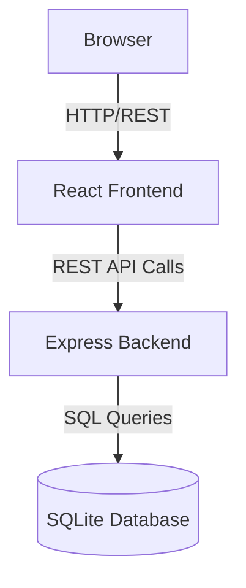

# SecureBank Architecture

## Overview
SecureBank is an intentionally vulnerable banking application built for a cybersecurity hackathon (Adversarial DevSecOps). It is designed to be small, stable, deterministic, and easy for AI agents to understand and attack in a controlled environment.

## Technology Stack
- **Frontend**: React + TypeScript + Vite
- **Backend**: Node.js + TypeScript + Express
- **Database**: SQLite
- **Infrastructure**: Docker + Docker Compose

## Architecture Diagram

## API Architecture
The backend uses a standard RESTful architecture over HTTP, consuming and producing JSON.
All API endpoints will be logically grouped under standard route paths (e.g., `/api/users`, `/api/accounts`).

## Authentication Approach
The application will use a custom session-based authentication mechanism.
- Users authenticate with username and password.
- The server generates a session token and stores it in the `sessions` table and sets it in a cookie.
- *Intentional vulnerabilities to be implemented in later phases include: missing HttpOnly/Secure flags, lack of CSRF tokens, predictable session IDs, and insecure password storage.*

## Data Model (SQLite)

The application uses SQLite as a single-file database for ease of setup and teardown.

### `users`
- `id` (INTEGER PRIMARY KEY)
- `username` (TEXT UNIQUE)
- `password_hash` (TEXT)
- `email` (TEXT)
- `role` (TEXT) - 'customer' or 'admin'
- `created_at` (DATETIME)

### `accounts`
- `id` (INTEGER PRIMARY KEY)
- `user_id` (INTEGER FOREIGN KEY to users)
- `account_number` (TEXT UNIQUE)
- `balance` (REAL)
- `account_type` (TEXT) - 'checking' or 'savings'

### `transactions`
- `id` (INTEGER PRIMARY KEY)
- `from_account_id` (INTEGER FOREIGN KEY to accounts)
- `to_account_id` (INTEGER FOREIGN KEY to accounts)
- `amount` (REAL)
- `description` (TEXT)
- `status` (TEXT) - 'pending' or 'completed'
- `created_at` (DATETIME)

### `uploads`
- `id` (INTEGER PRIMARY KEY)
- `user_id` (INTEGER FOREIGN KEY to users)
- `filename` (TEXT)
- `filepath` (TEXT)
- `uploaded_at` (DATETIME)

### `sessions`
- `id` (INTEGER PRIMARY KEY)
- `session_token` (TEXT UNIQUE)
- `user_id` (INTEGER FOREIGN KEY to users)
- `expires_at` (DATETIME)

## Vulnerability Isolation Strategy
- **Containerization**: Both the frontend and backend are run in isolated Docker containers using Docker Compose. This prevents any critical intentional vulnerabilities (like Remote Code Execution) from affecting the host machine.
- **Local Infrastructure**: No external services, cloud resources, or real financial APIs will be used. Everything runs locally.
- **Stateless/Ephemeral Storage**: The SQLite database file will be stored within the backend container structure. The system can be easily reset to a clean state by tearing down the containers and rebuilding them, ensuring deterministic test runs.
- **Seeding**: Hardcoded test users and financial data will be seeded at startup.
- **Safe Reset**: A mechanism (either an API endpoint or a container restart) will be available to clear the database and restore the initial vulnerable state.
