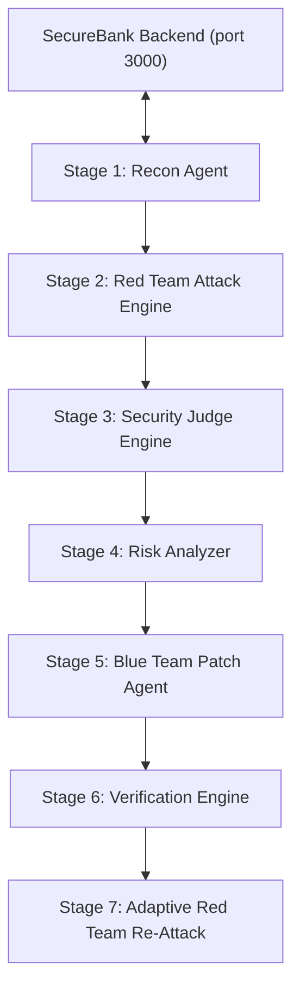

# Step-by-Step Execution Guide: Adversarial DevSecOps Pipeline (SecureBank `target_app`)

## Goal Description
This document provides a comprehensive, step-by-step guide for running, testing, and verifying the **IBM BOB 2.0 Autonomous DevSecOps Pipeline** against the actual **SecureBank (`target_app`)** application. 

With all connection references updated from the legacy mock app to the `target_app` service (`http://127.0.0.1:3000`), this guide outlines how to launch the backend, run the closed-loop multi-agent pipeline, and inspect security verdicts and remediation artifacts.

---

## User Review Required

> [!IMPORTANT]
> **Prerequisites Checklist**:
> 1. Node.js (v18+) & `npm` installed for starting `target_app`.
> 2. Python (v3.10+) available in environment PATH.
> 3. Target application running locally on `http://127.0.0.1:3000`.

---

## Architecture Overview



---

## Step-by-Step Guide

### Step 1: Start the SecureBank `target_app` Backend
Before starting the pipeline, launch the Express backend service:

```bash
# Navigate into target_app backend
cd "d:\0.CS PROJECTS\HACKATHONS\IBM BOB 2.0\target_app\backend"

# Install dependencies (if not already installed)
npm install

# Start the development server
npm run dev
```

*Expected Output*: `Server is running on port 3000`

---

### Step 2: Verify Target Application Health Check
In a new terminal window or shell prompt, verify that the health endpoint responds:

```bash
curl http://127.0.0.1:3000/health
```

*Expected Response*: `{"status":"ok"}`

---

### Step 3: Run the Autonomous Security Pipeline Engine
From the repository root, execute the main orchestrator script:

```bash
cd "d:\0.CS PROJECTS\HACKATHONS\IBM BOB 2.0"
python pipeline_runner.py
```

---

### Step 4: Pipeline Execution Sequence Overview

When `pipeline_runner.py` runs, it automatically executes the following 7 stages:

1. **Stage 1 [Recon Agent]**: Discovers static Express routes and live target endpoints (`/api/transactions/2`, `/api/transactions/search`).
2. **Stage 2 [Red Team Attack Engine]**: Executes IDOR and SQL Injection exploit payloads against `http://127.0.0.1:3000`.
3. **Stage 3 [Security Judge]**: Replays attack vectors to confirm or reject findings, eliminating false positives.
4. **Stage 4 [Risk Analyzer]**: Assigns CVSS severity ratings and prioritized risk scores to confirmed findings.
5. **Stage 5 [Blue Team Patch Agent]**: Generates remediation target specs for [`target_app/backend/src/controllers/transaction.ts`](file:///d:/0.CS%20PROJECTS/HACKATHONS/IBM%20BOB%202.0/target_app/backend/src/controllers/transaction.ts) and auto-generates regression tests in [`blue_team/tests/`](file:///d:/0.CS%20PROJECTS/HACKATHONS/IBM%20BOB%202.0/blue_team/tests/).
6. **Stage 6 [Verification Engine]**: Re-tests original exploit payloads and legitimate application requests to ensure zero regressions.
7. **Stage 7 [Adaptive Red Team]**: Searches for secondary bypass routes and validates defense boundaries.

---

### Step 5: Inspect Generated JSON Reports & Artifacts

After the pipeline finishes, review the output reports created across each module:

| Component | Output Location | Description |
|---|---|---|
| **Recon Map** | [`red_team/reports/recon_map.json`](file:///d:/0.CS%20PROJECTS/HACKATHONS/IBM%20BOB%202.0/red_team/reports/recon_map.json) | Discovered attack surface and route map |
| **Red Team Findings** | [`red_team/reports/VULN-001_finding.json`](file:///d:/0.CS%20PROJECTS/HACKATHONS/IBM%20BOB%202.0/red_team/reports/VULN-001_finding.json) | Captured exploit evidence and exfiltrated payloads |
| **Security Judge** | [`security_judge/reports/VULN-001_judge_result.json`](file:///d:/0.CS%20PROJECTS/HACKATHONS/IBM%20BOB%202.0/security_judge/reports/VULN-001_judge_result.json) | Independent reproduction log & verdict |
| **Risk Analyzer** | [`risk_analyzer/VULN-001_risk_report.json`](file:///d:/0.CS%20PROJECTS/HACKATHONS/IBM%20BOB%202.0/risk_analyzer/VULN-001_risk_report.json) | Risk score, blast radius, and prioritization |
| **Blue Team Patch** | [`blue_team/patches/VULN-001_patch_result.json`](file:///d:/0.CS%20PROJECTS/HACKATHONS/IBM%20BOB%202.0/blue_team/patches/VULN-001_patch_result.json) | Root cause diagnosis & patch metadata |
| **Regression Tests** | [`blue_team/tests/test_regression_vuln-001.py`](file:///d:/0.CS%20PROJECTS/HACKATHONS/IBM%20BOB%202.0/blue_team/tests/test_regression_vuln-001.py) | Auto-generated PyTest regression suites |
| **Verifier Report** | [`verifier/VULN-001_verification_result.json`](file:///d:/0.CS%20PROJECTS/HACKATHONS/IBM%20BOB%202.0/verifier/VULN-001_verification_result.json) | Verification proof and legitimate traffic health |

---

## Verification Plan

### Manual Verification
1. Run `python pipeline_runner.py` and confirm terminal displays all 7 stage execution blocks cleanly without runtime exceptions.
2. Confirm generated JSON reports under `red_team/reports/`, `security_judge/reports/`, `risk_analyzer/`, `blue_team/patches/`, and `verifier/` contain timestamps and status entries.
